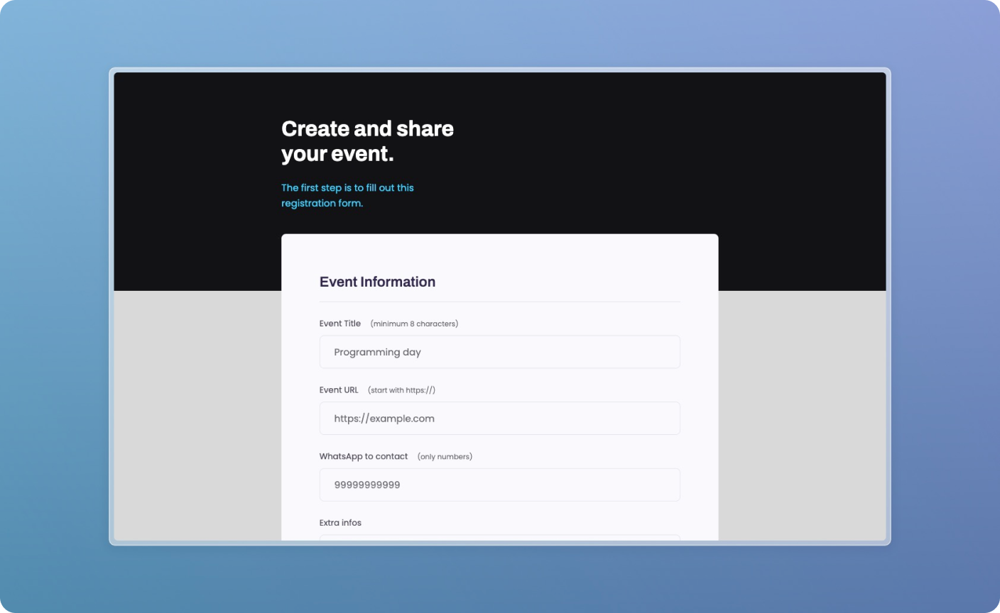

# Events form

Project developed on Rocketseat's Explorer course

**Events form is a page designed to learn basic web development concepts**

## 🔗 Project Links

- 🚀 [**Deploy**](https://emanueltavecia.github.io/events-form)
- 🎨 [**Figma**](https://www.figma.com/file/sgcJKpGAeVqh7rf2pwsOd9/Explorer-Stage-03-Projeto-01/duplicate)

## 📋 Project information

- Rocketseat Explorer
- Stage 03
- Project 03

## 🧠 Concepts learned

The development of this project aims to learn the following concepts:

- Basic structure of an HTML page
- More HTML tags
  - form, fieldset, legend, input, label, textarea, select
- Basic CSS styling
  - ::before, ::after, ::invalid, flex, appearance, background, position

## 💻 Technologies

## 📄 License

This project is licensed under the MIT License - see the [LICENSE](./LICENSE) file for more details.
